<a href="README.md">Español</a> · <strong>English</strong>

  <picture>
    <source media="(prefers-color-scheme: dark)" srcset="assets/header-en-dark.svg">
    
  </picture>

  <picture>
    <source media="(prefers-color-scheme: dark)" srcset="assets/typing-en-dark.svg">
    
  </picture>

  🎒 <strong>Second-year DAW student</strong> · 🌱 Learning PHP and Python · 🧩 Improving with every assignment

I like understanding how things work and turning that curiosity into code. This is my little corner to practise, make mistakes, learn and keep building. 🚀

## 🛠️ My toolbox

<table>
  <tr>
    <th align="center">🧩 Basic knowledge</th>
    <th align="center">🎨 Improving my web foundations</th>
    <th align="center">🌱 Currently learning</th>
  </tr>
  <tr>
    <td align="center">
       
      <strong>Java · SQL · Git</strong>
    </td>
    <td align="center">
       
      <strong>HTML · CSS · JavaScript</strong>
    </td>
    <td align="center">
       
      <strong>PHP · Python</strong>
    </td>
  </tr>
</table>

## 🔭 What sparks my curiosity

<table>
  <tr>
    <td width="50%">
      <strong>⚙️ Backend development</strong> 
      The logic behind every click: how data and an application's behaviour fit together.
    </td>
    <td width="50%">
      <strong>📊 Statistics and data</strong> 
      Finding patterns among the numbers and understanding what they tell us.
    </td>
  </tr>
  <tr>
    <td width="50%">
      <strong>🤖 Artificial intelligence</strong> 
      Exploring how programming and data can help solve problems.
    </td>
    <td width="50%">
      <strong>🧠 Machine learning</strong> 
      Understanding how a model learns, what it predicts and where it can go wrong.
    </td>
  </tr>
</table>

## 🧪 My DAW lab

Each repository is part of my learning: exercises, examples and small assignments that I expand throughout the course.

| Repository | What I'm practising |
| --- | --- |
| 🐘 [PHP exercises](https://github.com/cgonmat0908b/Ejercicios_PHP) | PHP fundamentals, arrays, classes and algorithms, organised by exercise set. |
| 🎨 [Web interface design](https://github.com/cgonmat0908b/DIW) | HTML, lists, disclosure elements, dialogs and an interactive gallery. |
| ⚡ [Client-side web development](https://github.com/cgonmat0908b/DWEC) | First steps with JavaScript: variables, types, conversions and scope. |
| 🐍 [Python](https://github.com/cgonmat0908b/Python) | Exercises, revision, control flow and collections. |
| 🌱 [Introduction to Python](https://github.com/cgonmat0908b/introduccion-al-uso-de-python) | An introductory assignment using lists, tuples and ranges. |

## 🧭 How I move forward

<table>
  <tr>
    <td width="50%"><strong>💪 Resilience</strong> Trying another approach when something gets stuck.</td>
    <td width="50%"><strong>👂 Active listening</strong> Learning from explanations and feedback.</td>
  </tr>
  <tr>
    <td width="50%"><strong>☀️ Positive attitude</strong> Keeping the desire to learn, one step at a time.</td>
    <td width="50%"><strong>🪞 Self-reflection</strong> Reviewing my mistakes and turning them into improvements.</td>
  </tr>
</table>

  

