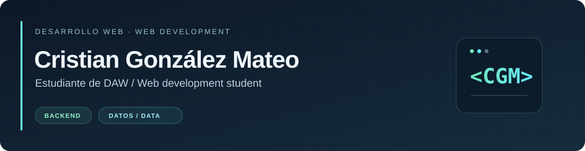

<strong>Español</strong> · <a href="README.en.md">English</a>

  <picture>
    <source media="(prefers-color-scheme: dark)" srcset="assets/header-dark.svg">
    
  </picture>

  <picture>
    <source media="(prefers-color-scheme: dark)" srcset="assets/typing-es-dark.svg">
    
  </picture>

  🎒 <strong>2.º de DAW</strong> · 🌱 Aprendiendo PHP y Python · 🧩 Mejorando con cada práctica

Me gusta entender cómo funcionan las cosas y convertir esa curiosidad en código. Este es mi rincón para practicar, equivocarme, aprender y seguir construyendo. 🚀

## 🛠️ Mi caja de herramientas

<table>
  <tr>
    <th align="center">🧩 Conocimientos básicos</th>
    <th align="center">🎨 Reforzando la base web</th>
    <th align="center">🌱 En aprendizaje</th>
  </tr>
  <tr>
    <td align="center">
       
      <strong>Java · SQL · Git</strong>
    </td>
    <td align="center">
       
      <strong>HTML · CSS · JavaScript</strong>
    </td>
    <td align="center">
       
      <strong>PHP · Python</strong>
    </td>
  </tr>
</table>

## 🔭 Lo que me despierta curiosidad

<table>
  <tr>
    <td width="50%">
      <strong>⚙️ Backend</strong> 
      La lógica detrás de cada clic: cómo encajan los datos y el funcionamiento de una aplicación.
    </td>
    <td width="50%">
      <strong>📊 Estadística y datos</strong> 
      Encontrar patrones entre tantos números y entender qué nos están contando.
    </td>
  </tr>
  <tr>
    <td width="50%">
      <strong>🤖 Inteligencia artificial</strong> 
      Explorar cómo la programación y los datos pueden ayudar a resolver problemas.
    </td>
    <td width="50%">
      <strong>🧠 Machine learning</strong> 
      Entender cómo aprende un modelo, qué predice y dónde puede equivocarse.
    </td>
  </tr>
</table>

## 🧪 Mi laboratorio de DAW

Cada repositorio es una parte de mi aprendizaje: ejercicios, ejemplos y pequeñas prácticas que voy ampliando durante el curso.

| Repositorio | Qué estoy practicando |
| --- | --- |
| 🐘 [Ejercicios PHP](https://github.com/cgonmat0908b/Ejercicios_PHP) | Fundamentos de PHP, arrays, clases y algoritmos, organizados por relación. |
| 🎨 [Diseño de interfaces web](https://github.com/cgonmat0908b/DIW) | HTML, listas, desplegables, diálogos y una galería interactiva. |
| ⚡ [Desarrollo web en el cliente](https://github.com/cgonmat0908b/DWEC) | Primeros pasos con JavaScript: variables, tipos, conversiones y ámbito. |
| 🐍 [Python](https://github.com/cgonmat0908b/Python) | Ejercicios, repasos, estructuras de control y colecciones. |
| 🌱 [Introducción a Python](https://github.com/cgonmat0908b/introduccion-al-uso-de-python) | Una práctica inicial con listas, tuplas y rangos. |

## 🧭 Mi forma de avanzar

<table>
  <tr>
    <td width="50%"><strong>💪 Resiliencia</strong> Probar otro camino cuando algo se atasca.</td>
    <td width="50%"><strong>👂 Escucha activa</strong> Aprender de las explicaciones y del feedback.</td>
  </tr>
  <tr>
    <td width="50%"><strong>☀️ Actitud positiva</strong> Seguir con ganas de aprender, paso a paso.</td>
    <td width="50%"><strong>🪞 Autocrítica</strong> Revisar mis errores y convertirlos en mejoras.</td>
  </tr>
</table>

  

